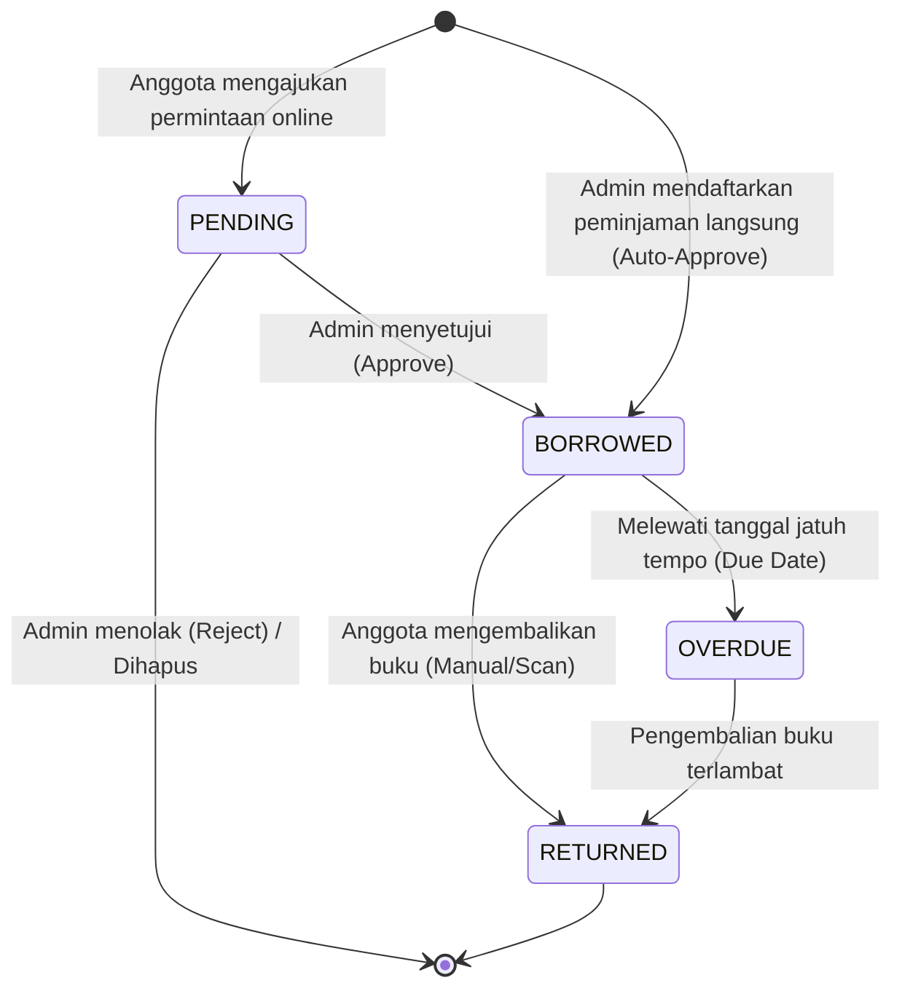
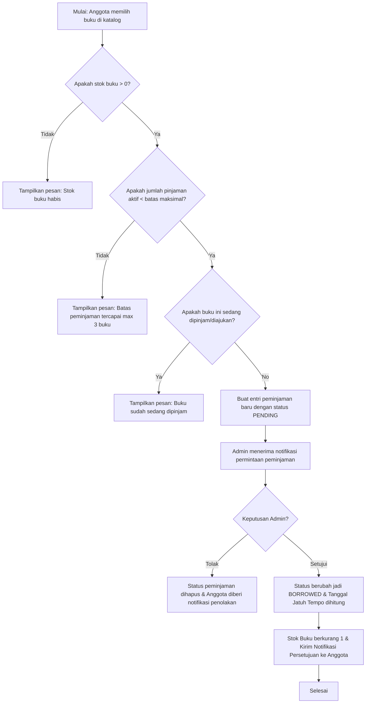
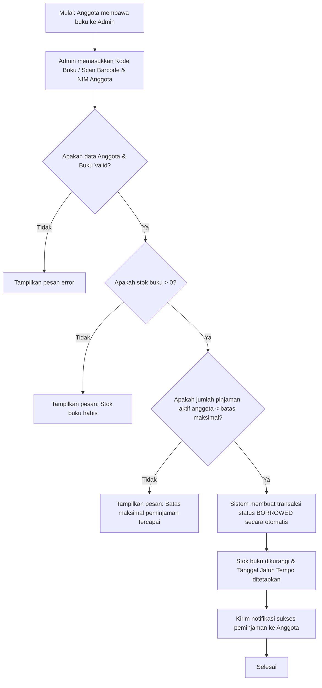
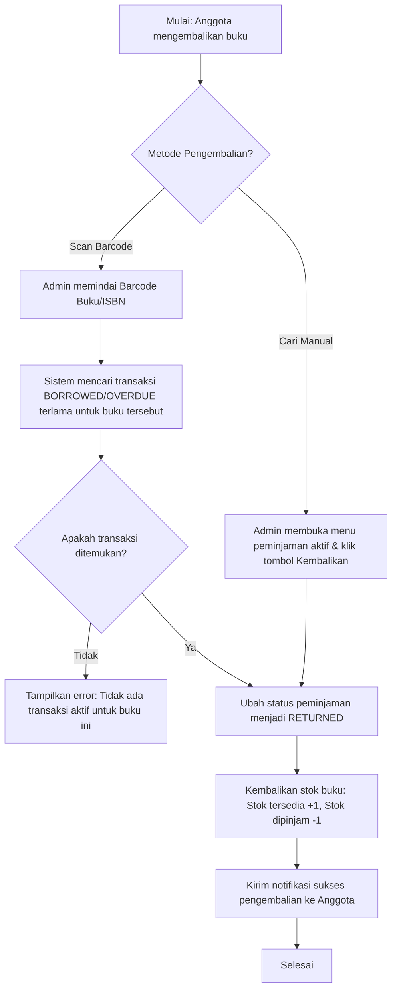

# Dokumentasi Alur Sistem Peminjaman - Pustaka Jalanan

Dokumentasi ini menjelaskan secara lengkap alur peminjaman dan pengembalian buku pada sistem **Pustaka Jalanan**, baik dari sisi Anggota (Borrower) maupun Admin (Admin Pustaka Jalanan & Super Admin).

---

## 1. Peran Pengguna (Actors)

Dalam sistem peminjaman, terdapat dua kategori peran utama:

1. **Anggota (Borrower):**
   - Mengajukan permintaan peminjaman buku melalui aplikasi web/mobile.
   - Melihat riwayat peminjaman pribadi dan tenggat waktu pengembalian.
   - Menerima notifikasi status peminjaman.

2. **Admin (Admin Pustaka Jalanan & Super Admin):**
   - Menyetujui (*Approve*) atau menolak (*Reject*) permintaan peminjaman anggota.
   - Memproses peminjaman langsung (pendaftaran peminjaman oleh admin di tempat).
   - Memproses pengembalian buku (secara manual atau melalui fitur scan barcode buku).

---

## 2. Diagram Status Peminjaman (State Diagram)

Setiap transaksi peminjaman melewati beberapa fase status yang didefinisikan sebagai berikut:

### Penjelasan Status:
- **`PENDING`**: Permintaan peminjaman telah dikirim oleh Anggota, menunggu verifikasi Admin. Stok buku belum berkurang.
- **`BORROWED`**: Peminjaman aktif disetujui. Stok buku berkurang 1, dan stok pinjam bertambah 1. Tanggal jatuh tempo (*due date*) ditetapkan.
- **`RETURNED`**: Buku telah sukses dikembalikan. Stok buku dikembalikan ke kondisi semula.
- **`OVERDUE`**: Buku belum dikembalikan dan waktu peminjaman telah melewati batas jatuh tempo yang ditentukan.

---

## 3. Alur Proses (Flowchart)

### A. Alur Pengajuan Peminjaman Online oleh Anggota

Alur ini terjadi ketika Anggota memilih buku di katalog aplikasi dan mengajukan pinjam secara mandiri.

### B. Alur Peminjaman Langsung di Tempat oleh Admin

Alur ini digunakan ketika Anggota datang langsung ke perpustakaan untuk meminjam buku. Admin memproses transaksi secara langsung.

### C. Alur Pengembalian Buku

Proses pengembalian dapat diproses secara manual melalui daftar peminjaman admin, atau secara cepat menggunakan **Scan Barcode Buku**.

---

## 4. Validasi & Pembatasan Bisnis (Business Rules)

Untuk menjaga sirkulasi buku tetap stabil, sistem menerapkan batasan otomatis berikut:

1. **Batas Maksimal Buku:**
   Setiap anggota dibatasi hanya boleh meminjam/mengajukan maksimal **3 buku** secara bersamaan (kombinasi status `PENDING` dan `BORROWED`).
2. **Durasi Peminjaman Default:**
   Durasi peminjaman default adalah **14 hari** (dapat diubah sesuai konfigurasi default pada database `BorrowingSettings`).
3. **Pencegahan Duplikasi:**
   Anggota tidak dapat mengajukan peminjaman untuk buku yang sama jika dia sedang meminjam buku tersebut atau pengajuannya masih berstatus `PENDING`.
4. **Validasi Stok:**
   Peminjaman hanya dapat disetujui jika stok tersedia (*available stock*) buku di atas 0.

---

## 5. Audit Log (Log Audit)

Setiap aksi perubahan status peminjaman akan secara otomatis dicatat dalam sistem log audit untuk keamanan dan pemantauan:
- Aksi **`BORROW`** dicatat saat pengajuan atau pembuatan transaksi.
- Aksi **`APPROVE`** dicatat saat admin menyetujui transaksi.
- Aksi **`RETURN`** dicatat saat buku sukses dikembalikan.
- Aksi **`REJECT`** dicatat saat pengajuan ditolak.
