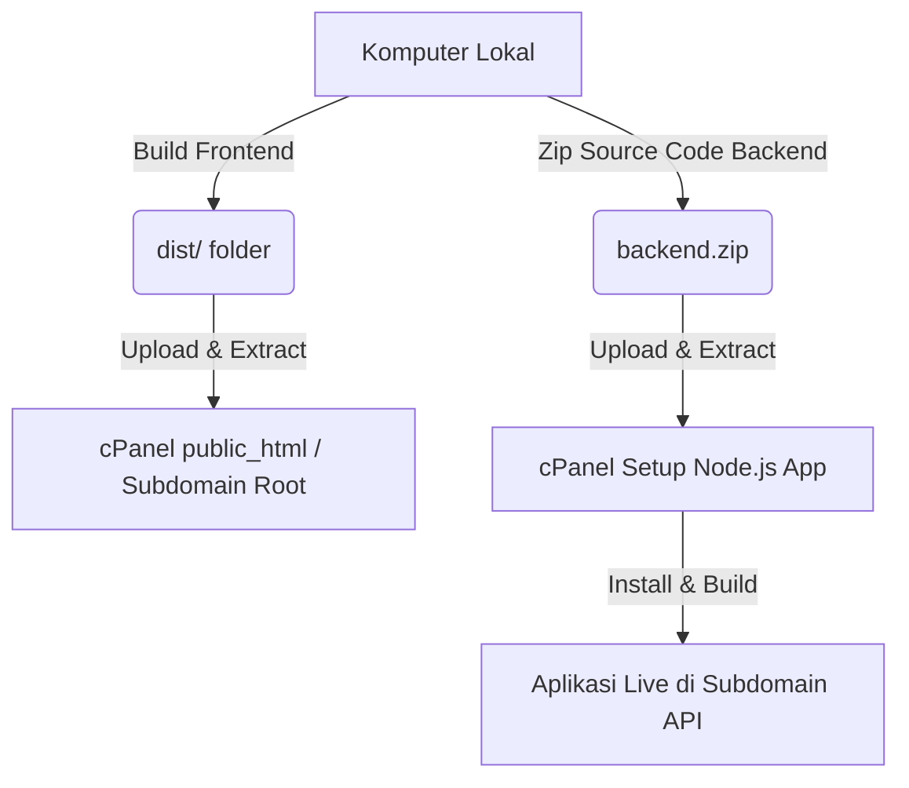

# Panduan Deployment & Upload Perpustakaan Digital Lintang Songo ke cPanel

Panduan ini berisi langkah-langkah terperinci untuk mengunggah dan menjalankan aplikasi **Perpustakaan Digital PMII Lintang Songo** ke hosting cPanel Anda.

Aplikasi kita terbagi menjadi dua bagian utama:
1. **Frontend**: Aplikasi Single Page Application (SPA) berbasis **Vite + Vue 3**.
2. **Backend**: REST API Server berbasis **Node.js Express + TypeScript** dengan database **MySQL**.

---

## Ringkasan Alur Deployment


---

## 🚀 Langkah 1: Build & Deploy Frontend (Lokal ke cPanel)

Frontend adalah aplikasi statis (SPA). Proses kompilasi (build) dilakukan di komputer lokal Anda, lalu hasilnya diunggah ke cPanel.

### 1. Konfigurasi Environment Produksi
Buka file `frontend/.env` atau buat jika belum ada, lalu sesuaikan URL API-nya ke subdomain produksi backend Anda:
```env
VITE_API_URL=https://api.buku.pmiiunusida.com
```
*(Menggunakan alamat subdomain API backend cPanel Anda)*.

### 2. Jalankan Build di Komputer Lokal
Buka terminal pada direktori `frontend` lokal Anda, lalu jalankan:
```bash
npm run build
```
Proses ini akan menghasilkan folder bernama **`dist`** di dalam folder `frontend`.

### 3. Unggah ke cPanel
1. Masuk ke **cPanel File Manager**.
2. Buka folder tujuan website utama Anda (misal `public_html` atau root folder subdomain Anda).
3. Kompres/Zip isi dari folder `frontend/dist` (jangan zip folder `dist`-nya sendiri, melainkan file-file di dalamnya seperti `index.html`, `assets/`, `logo.png`, dll).
4. Unggah file zip tersebut ke File Manager dan lakukan **Extract**.
5. Tambahkan atau konfigurasi file `.htaccess` di root folder tersebut agar routing SPA (Vue Router) dapat bekerja dengan baik saat halaman di-refresh:

```apache
<IfModule mod_rewrite.c>
  RewriteEngine On
  RewriteBase /
  RewriteRule ^index\.html$ - [L]
  RewriteCond %{REQUEST_FILENAME} !-f
  RewriteCond %{REQUEST_FILENAME} !-d
  RewriteRule . /index.html [L]
</IfModule>
```

---

## ⚙️ Langkah 2: Deploy Backend (Express Node.js)

Backend memerlukan lingkungan Node.js aktif di cPanel untuk menjalankan server Express.

### 1. Build Lokal & Kompres Backend
Untuk menghindari kelebihan beban resource (CPU/RAM limit) di cPanel Shared Hosting, **build/kompilasi TypeScript backend dilakukan di komputer lokal Anda terlebih dahulu**:

1. Buka terminal pada folder `backend` lokal Anda, lalu jalankan:
   ```bash
   npm run build
   ```
   Perintah ini akan men-generate folder **`dist`** yang berisi javascript hasil kompilasi.
2. Kompres folder `backend` menjadi ZIP untuk diunggah.
   > [!IMPORTANT]
   > * **WAJIB sertakan folder `dist`** hasil build lokal.
   > * **JANGAN sertakan folder `node_modules`** agar ukuran zip kecil dan menghindari error OS mismatch.

File/folder penting yang wajib dimasukkan dalam ZIP:
- **`dist/`** (sangat penting!)
- `config/`, `controllers/`, `middleware/`, `models/`, `routes/`, `seeders/`, `services/`, `utils/`, `uploads/`
- `index.ts`, `setup_database.ts`, `package.json`, `package-lock.json`, `tsconfig.json`

### 2. Unggah dan Ekstrak di cPanel
1. Masuk ke **File Manager** cPanel.
2. Buat folder baru di luar `public_html` (misalnya di `/home/username/nodeapps/backend`).
3. Unggah file zip backend Anda ke dalam folder tersebut dan lakukan **Extract**.

### 3. Konfigurasi Environment Variables (.env)
Sebelum menjalankan backend, buat file konfigurasi `.env` di server:
1. Copy file `backend/.env.example` menjadi `backend/.env` di server menggunakan File Manager cPanel.
2. Edit file `.env` tersebut dan masukkan nilai berikut:
   ```env
   NODE_ENV=production
   PORT=5000
   APP_NAME="Buku PMII"
   APP_URL=https://api.buku.pmiiunusida.com
   FRONTEND_URL=https://buku.pmiiunusida.com
   DB_HOST=127.0.0.1
   DB_USER=username_dbuser
   DB_PASSWORD=password_anda
   DB_NAME=username_dbname
   DB_PORT=3306
   JWT_ACCESS_SECRET=buat_string_acak_panjang_disini
   JWT_REFRESH_SECRET=buat_string_acak_panjang_lainnya
   CORS_ORIGINS=https://buku.pmiiunusida.com,http://localhost:5173
   ```

---

### 4. Menjalankan Aplikasi di Server (Pilih Salah Satu Metode)

Tergantung fitur cPanel Anda, pilih salah satu metode di bawah ini untuk menjalankan server Node.js:

#### Opsi A: Menggunakan Menu "Setup Node.js App" (Rekomendasi jika ada)
1. Masuk ke cPanel dan buka menu **Setup Node.js App**.
2. Klik **Create Application** dan isi konfigurasi:
   - **Node.js Version**: Pilih versi stabil (misal v18 atau v20).
   - **Application Mode**: `Production`.
   - **Application Root**: Path folder backend Anda (misal `nodeapps/backend`).
   - **Application URL**: Pilih subdomain API Anda (`api.buku.pmiiunusida.com`).
   - **Application Startup File**: Isi dengan **`dist/index.js`**.
3. Klik **Create**.
4. Salin baris perintah virtual environment di bagian atas halaman (contoh: `source /home/username/.../activate && cd ...`).
5. Buka **Terminal** cPanel, paste perintah tersebut lalu jalankan:
   ```bash
   npm install --omit=dev
   ```
6. Buka kembali halaman Setup Node.js App dan klik **Restart**.

#### Opsi B: Menggunakan Terminal SSH & PM2 (Jika "Setup Node.js App" tidak ada)
Jika hosting Anda tidak menyediakan antarmuka pembuat aplikasi Node.js, Anda bisa menjalankannya langsung melalui Terminal/SSH:
1. Buka **Terminal** bawaan cPanel atau koneksikan SSH.
2. Pindah ke direktori backend Anda:
   ```bash
   cd ~/nodeapps/backend
   ```
3. Instal dependencies produksi:
   ```bash
   npm install --omit=dev
   ```
4. Jalankan aplikasi di background menggunakan **PM2** agar server otomatis restart jika terjadi crash:
   ```bash
   npx pm2 start dist/index.js --name "buku-pmii-api"
   ```
   *(Jika PM2 belum terpasang, perintah npx di atas akan otomatis mengunduh dan menjalankannya).*
5. **Konfigurasi Reverse Proxy (.htaccess)**:
   Karena backend berjalan di port internal (misal port `5000`), kita perlu mengarahkan traffic dari subdomain API (`api.buku.pmiiunusida.com`) ke port tersebut.
   * Buka File Manager cPanel, masuk ke folder root subdomain Anda (misal `public_html/api` atau folder subdomain Anda).
   * Buat/edit file `.htaccess` di folder tersebut dan isi dengan rule proxy berikut:
     ```apache
     DirectoryIndex disabled
     RewriteEngine On
     RewriteRule ^$ http://127.0.0.1:5000/ [P,L]
     RewriteCond %{REQUEST_FILENAME} !-f
     RewriteCond %{REQUEST_FILENAME} !-d
     RewriteRule ^(.*)$ http://127.0.0.1:5000/$1 [P,L]
     ```
     *(Rule ini mengalihkan semua request secara transparan dari `https://api.buku.pmiiunusida.com/*` ke port `5000`)*.

---

## 🗄️ Langkah 3: Konfigurasi Database (MySQL)

1. Di cPanel, buka **MySQL Database Wizard**.
2. Buat database baru (misal: `perpus_pmii`).
3. Buat user database baru dan buat password yang kuat.
4. Hubungkan user ke database tersebut dengan memilih opsi **ALL PRIVILEGES**.
5. Untuk membuat tabel-tabel dan mengisi data awal (seeder admin default), Anda bisa menjalankan skrip inisialisasi database melalui terminal cPanel (dalam virtual env backend):
   ```bash
   npx ts-node setup_database.ts
   ```
   *Skrip ini akan otomatis membuat tabel, relasi, dan menambahkan akun administrator default.*

---

## 🔍 Langkah 4: Uji Coba Deployment

1. **Uji Health Check API**:
   Buka browser dan akses endpoint health check API Anda:
   `https://api.buku.pmiiunusida.com/health`
   Pastikan merespons status `healthy` dan koneksi database MySQL terhubung sukses.

2. **Uji Frontend**:
   Buka alamat website utama Anda, pastikan logo komisariat tampil di tab browser (favicon) dan layout memuat data dengan benar tanpa ada error CORS.

---

## 💡 Troubleshooting & Tips Tambahan
- **Folder Uploads**: Pastikan folder `/home/username/nodeapps/backend/uploads` ada dan memiliki hak akses baca-tulis (`chmod 755`) agar admin dapat mengunggah cover buku dengan lancar.
- **Error CORS**: Jika frontend tidak dapat meminta data ke API backend, pastikan URL frontend sudah didaftarkan di konfigurasi CORS backend di `.env` (yaitu `CORS_ORIGINS=https://buku.pmiiunusida.com`).
- **Restart Aplikasi**: Setiap kali ada pembaruan kode backend, Anda harus menekan tombol **Restart** pada Setup Node.js App di cPanel agar server memuat kode JavaScript terbaru.
