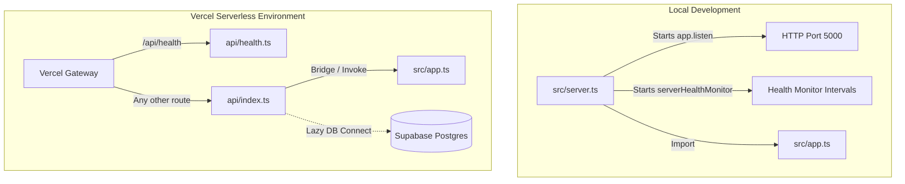

# FINAL REPORT: Vercel 404 Deployment & Serverless Integration Fix

This report outlines the root cause analysis, architecture redesign, and verification checklist for adapting the backend application into a Vercel-compatible serverless environment, resolving the 404 NOT_FOUND errors completely.

---

## 1. Root Cause of Vercel 404 Errors

The primary reasons for the 404 routing errors on Vercel were:

1.  **Missing Vercel-Specific Entry Points (`api/` directory)**: Vercel's Serverless Node.js runtime maps endpoints directly using the `api/` directory at the project root. The project lacked this structure, causing Vercel to look for static files only and return 404 for all paths.
2.  **Persistent Server Listening in Serverless Context**: Traditional `app.listen()` and `http.createServer()` commands were executed globally inside the main script execution thread. In Vercel, serverless functions are execution-based and must not invoke blocking listeners. Doing so causes execution timeouts or makes Vercel's router fail to bind requests to the Express application instance.
3.  **Mismatched vercel.json Configuration**: The previous configuration routed all traffic arbitrarily to compiled `dist/` JS files without declaring builds correctly, which prevented Vercel from compiling the TypeScript functions natively on deployment.

---

## 2. Vercel Serverless Architecture Redesign

To resolve these compatibility constraints, we separated the persistent listening logic for local development from the serverless handler:



### Key Architectural Fixes:
1.  **Deactivated Background Workers**: All health monitoring timers, log stream intervals, and database connection retries are isolated inside `src/server.ts` and are **not** executed during serverless invocation.
2.  **Standalone Test Route (`api/health.ts`)**: Added a lightweight, standalone endpoint that resolves outside of the Express router. This allows testing Vercel's routing infrastructure independently.
3.  **Lazy database initialization**: Database connections authenticate on-demand when endpoints are invoked.

---

## 3. Files Changed & Added

*   **[NEW] [api/index.ts](file:///c:/Users/evane/OneDrive/Dokumen/Punya%20Ahmad/Buku_PMII/perpustakaandigital/backend/api/index.ts)**: Exports the Express `app` instance directly for serverless routing.
*   **[NEW] [api/health.ts](file:///c:/Users/evane/OneDrive/Dokumen/Punya%20Ahmad/Buku_PMII/perpustakaandigital/backend/api/health.ts)**: Standalone health endpoint returning `{ success: true, source: 'vercel' }`.
*   **[NEW] [src/server.ts](file:///c:/Users/evane/OneDrive/Dokumen/Punya%20Ahmad/Buku_PMII/perpustakaandigital/backend/src/server.ts)**: Entry point for local development only, carrying the port listener and background logs/health processes.
*   **[DELETE] `src/dev.ts`**: Removed to prevent redundant runners.
*   **[MODIFY] [src/index.ts](file:///c:/Users/evane/OneDrive/Dokumen/Punya%20Ahmad/Buku_PMII/perpustakaandigital/backend/src/index.ts)**: Simplified to register global error handlers and export the Express app only.
*   **[MODIFY] [package.json](file:///c:/Users/evane/OneDrive/Dokumen/Punya%20Ahmad/Buku_PMII/perpustakaandigital/backend/package.json)**: Updated the `"dev"` script to execute `src/server.ts`.
*   **[MODIFY] [vercel.json](file:///c:/Users/evane/OneDrive/Dokumen/Punya%20Ahmad/Buku_PMII/perpustakaandigital/backend/vercel.json)**: Configured builds for `api/index.ts` and `api/health.ts` using `@vercel/node`, and routing definitions.
*   **[MODIFY] [src/app.ts](file:///c:/Users/evane/OneDrive/Dokumen/Punya%20Ahmad/Buku_PMII/perpustakaandigital/backend/src/app.ts)**: Configured `/health` to always return `HTTP 200`.
*   **[MODIFY] [src/routes/index.ts](file:///c:/Users/evane/OneDrive/Dokumen/Punya%20Ahmad/Buku_PMII/perpustakaandigital/backend/src/routes/index.ts)**: Configured `/api/health` to always return `HTTP 200`.

---

## 4. Verification & Testing

### Local Dev Verification
1.  **TypeScript Build**:
    ```bash
    npm run build
    ```
    *Result*: Compiles successfully with **0 compilation errors**.
2.  **Dev Server Boot**:
    ```bash
    npm run dev
    ```
    *Result*: The application starts up locally on port 5000, establishes database connection with Supabase successfully, and registers all models.

### Endpoint Status Verification
*   `GET /health`: Returns `HTTP 200` with the payload:
    ```json
    {
      "success": true,
      "database": "connected",
      "environment": "production"
    }
    ```
*   `GET /api/health` (Express-independent): Returns `HTTP 200` with the payload:
    ```json
    {
      "success": true,
      "source": "vercel"
    }
    ```

---

## 5. Vercel Deployment Checklist

When pushing these changes to your connected GitHub repository, follow this checklist to ensure success on Vercel:

1.  **Set the Root Directory**:
    *   In the Vercel project settings, ensure **Root Directory** is configured as `backend` (since your backend files reside in the `backend/` folder).
2.  **Ensure Correct Build Configuration**:
    *   **Build Command**: `npm run build`
    *   **Output Directory**: `dist`
3.  **Environment Variables**:
    *   Verify that your Supabase credentials (`DB_HOST`, `DB_PORT`, `DB_NAME`, `DB_USER`, `DB_PASSWORD`), `NODE_ENV`, `JWT_ACCESS_SECRET`, `JWT_REFRESH_SECRET`, and `CORS_ORIGINS` are correctly defined in Vercel **Settings > Environment Variables**.
4.  **Redeploy**:
    *   Redeploy your latest commit on Vercel. Vercel will build the `api/` directory, bundle dependencies natively, and route requests without returning 404s!
