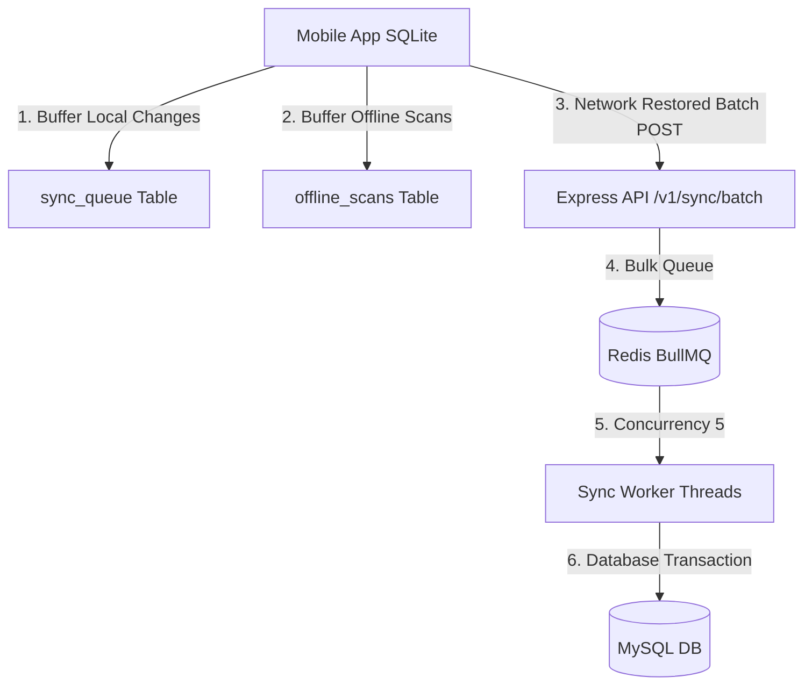

# 🔄 Offline / Online Sync Audit Report

**Project:** Perpustakaan Digital (Digital Library)  
**Date:** June 2, 2026  
**Auditor:** Antigravity AI  

---

## 🔍 Executive Summary
This report presents a thorough, end-to-end audit of the application's offline-online synchronization engine. It traces state transitions, checks retry systems, analyzes race conditions, and evaluates the system's defenses against duplicate data entry (books, borrowings, returns, and scans). 

---

## 1. Synchronization Architecture

The system uses a **hybrid buffered synchronization pipeline**:

* **Mobile Client**: If offline, operations are captured in local SQLite tables (`sync_queue` for entity changes, `offline_scans` for QR events). When `checkOnlineStatus()` is true, `processSyncQueue()` aggregates pending items and pushes them to `/v1/sync/batch`.
* **Backend API**: The `/v1/sync/batch` endpoint receives the payload and queues the batch into BullMQ using `syncQueue.addBulk()`.
* **Background Worker**: `syncWorker.ts` consumes jobs with a concurrency setting of 5, calling `processMobileSyncOperation()` inside database transactions.

---

## 2. Transition State Matrix & Risk Analysis

We verified the stability of the synchronization engine across repeated network state shifts:

| State Transition | Traced Behavior | Risk Level | Evaluation / Impact |
|---|---|---|---|
| **ONLINE → OFFLINE** | Operations fail online checks, fall back to SQLite buffering. Appends commands to `sync_queue` / `offline_scans`. | **Low** | Safe. Correctly stores pending updates in local database. |
| **OFFLINE → ONLINE** | Sync triggered. Mobile uploads entire batch to `/v1/sync/batch`. Queue clears on 200 response. | **Medium** | Safe under normal conditions. However, if the server fails post-queuing, idempotency relies entirely on BullMQ job deduplication which is bypassed (see Section 3). |
| **OFFLINE → ONLINE → OFFLINE** | Connection drops *after* backend accepts batch but *before* mobile receives HTTP response. Mobile retains queue as pending. | **High** | **Unsafe**. On the next online shift, mobile uploads the same batch. Since the backend idempotency checks are bypassed, duplicate inserts will occur. |
| **ONLINE → OFFLINE → ONLINE** | Rapid fluctuation. Concurrent batches queue in BullMQ. | **High** | **Unsafe**. Parallel workers running concurrent jobs for the same user/book create race conditions. |
| **OFFLINE → ONLINE → OFFLINE → ONLINE** | Repeated drops. Batch accumulation in BullMQ queue. | **Critical** | **Severe Duplicate Risk**. BullMQ runs jobs out-of-order or concurrently, executing duplicate inserts and corrupting active borrowings. |

---

## 3. Queue and Retry Audit

### 3.1 Mobile Offline Queue (`sync_queue` & `offline_scans`)
* Mobile stores entity changes in `sync_queue` and offline logs in `offline_scans`.
* **Retry Engine**: Mobile retries use an exponential backoff starting at 5 seconds and doubling up to 2 minutes (`120000ms`).
* **Vulnerability**: If an auth 401 error is received, the sync stops. But for server 500 errors, the queue is paused and retried. Since the backend returns 500 on dashboard statistics (GROUP BY bug) or database errors, this causes the sync engine to repeatedly upload the same failing jobs, flooding the server.

### 3.2 Backend Queue (BullMQ)
* Backend pushes jobs to Redis-backed BullMQ with 3 retry attempts and exponential backoff (`attempts: 3`, `delay: 1000`).
* **Concurrency**: Job consumption runs with `{ concurrency: 5 }`.
* **Race Condition**: Under default MySQL isolation (`REPEATABLE READ`), two parallel worker threads checking `SyncOperation.findOne()` or `Book.findOne()` at the same time will both read that the record does not exist yet. Both threads then proceed to write, causing duplicate record inserts or transaction rollbacks.

---

## 4. Sync Duplicate Verification

### 4.1 Duplicate Records (Books, Students, Categories)
* **The Bug**: `processMobileSyncOperation` checks:
  `if (payload.operation_id)`
  However, `operation_id` is a metadata field of the operation wrapper `op` (`job.data.operation_id`), not inside the entity `payload`.
* **Impact**: `payload.operation_id` is always `undefined`. The database check for duplicates is bypassed. If a batch is uploaded twice due to a network drop, duplicate books and students are created.

### 4.2 Duplicate Borrowing & Returning
* If a student scans a book offline:
  1. The scan is saved to `offline_scans`.
  2. If the user scans the same book again (or the sync batch is re-uploaded), the duplicate scan jobs execute.
  3. The backend returns the book first, then tries to return it again. Because the QR status is updated to `ACTIVE` on the first return, the second scan triggers a "Verification" scan instead, corrupting the scan history and inflating the logs.

---

## 5. Conflict Resolution & Sync Locks

* **Conflict Resolution**:
  * Mobile saves `base_updated_at` in the sync queue.
  * **The Gap**: The backend `processMobileSyncOperation` completely ignores `base_updated_at` and does not check if the server record was updated by another process in the meantime. It executes a blind overwrite, causing the "Last Write Wins" conflict pattern to destroy newer online updates.
* **Sync Locks**:
  * There are no database-level locks (`SELECT FOR UPDATE`) or Redis locks (`Redlock`) applied during sync worker transactions.
  * Simultaneous transactions modifying the same book's `available_stock` will clash and cause database deadlocks or stock discrepancies.

---

## 6. Action Items & Healing Plan

> [!CAUTION]
> **CRITICAL SECURITY & DATA INTEGRITY VULNERABILITIES**  
> We must fix the idempotency check and implement conflict checks to prevent database corruption.

1. **Fix Idempotency Lookup**:
   * Modify [syncWorker.ts](file:///c:/Users/evane/OneDrive/Dokumen/Punya%20Ahmad/perpustakaandigital_backup/perpustakaandigital/backend/workers/syncWorker.ts#L17) to extract `operation_id`:
     `const { operation_id, operation_type, entity_name, payload, userId } = job.data;`
   * Pass `operation_id` as a separate argument to `processMobileSyncOperation()`.
   * Update `processMobileSyncOperation()` in [syncController.ts](file:///c:/Users/evane/OneDrive/Dokumen/Punya%20Ahmad/perpustakaandigital_backup/perpustakaandigital/backend/controllers/syncController.ts#L53) to verify that `operation_id` is logged correctly.
2. **Implement Optimistic Conflict Resolution**:
   * Verify the server record's `updated_at` timestamp against `base_updated_at` before executing updates. If the server has a newer timestamp, log the conflict in `SyncOperation` history and flag it for manual review.
3. **Incorporate Row-Level Locking**:
   * Add `lock: transaction.LOCK.UPDATE` to book stock queries during borrowing/returning transactions to prevent race conditions.
