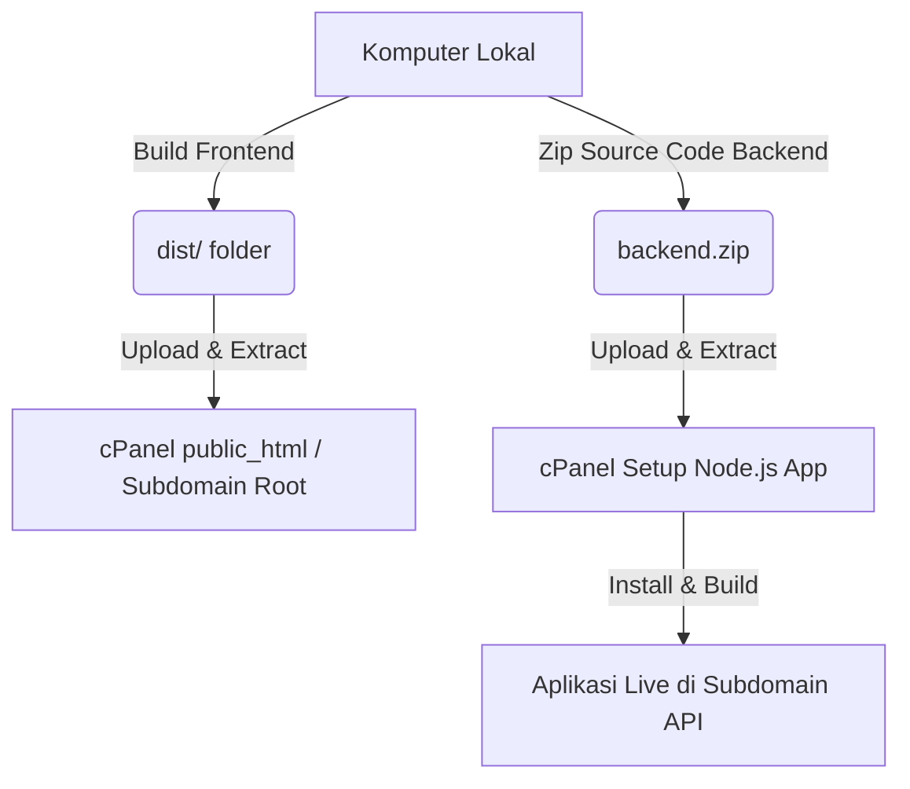

# Panduan Deployment & Upload Perpustakaan Digital Lintang Songo ke cPanel

Panduan ini berisi langkah-langkah terperinci untuk mengunggah dan menjalankan aplikasi **Perpustakaan Digital PMII Lintang Songo** ke hosting cPanel Anda.

Aplikasi kita terbagi menjadi dua bagian utama:
1. **Frontend**: Aplikasi Single Page Application (SPA) berbasis **Vite + Vue 3**.
2. **Backend**: REST API Server berbasis **Node.js Express + TypeScript** dengan database **MySQL**.

---

## Ringkasan Alur Deployment


---

## 🚀 Langkah 1: Build & Deploy Frontend (Lokal ke cPanel)

Frontend adalah aplikasi statis (SPA). Proses kompilasi (build) dilakukan di komputer lokal Anda, lalu hasilnya diunggah ke cPanel.

### 1. Konfigurasi Environment Produksi
Buka file `frontend/.env` atau buat jika belum ada, lalu sesuaikan URL API-nya ke subdomain produksi backend Anda:
```env
VITE_API_URL=https://api.buku.pmiiunusida.com
```
*(Menggunakan alamat subdomain API backend cPanel Anda)*.

### 2. Jalankan Build di Komputer Lokal
Buka terminal pada direktori `frontend` lokal Anda, lalu jalankan:
```bash
npm run build
```
Proses ini akan menghasilkan folder bernama **`dist`** di dalam folder `frontend`.

### 3. Unggah ke cPanel
1. Masuk ke **cPanel File Manager**.
2. Buka folder tujuan website utama Anda (misal `public_html` atau root folder subdomain Anda).
3. Kompres/Zip isi dari folder `frontend/dist` (jangan zip folder `dist`-nya sendiri, melainkan file-file di dalamnya seperti `index.html`, `assets/`, `logo.png`, dll).
4. Unggah file zip tersebut ke File Manager dan lakukan **Extract**.
5. Tambahkan atau konfigurasi file `.htaccess` di root folder tersebut agar routing SPA (Vue Router) dapat bekerja dengan baik saat halaman di-refresh:

```apache
<IfModule mod_rewrite.c>
  RewriteEngine On
  RewriteBase /
  RewriteRule ^index\.html$ - [L]
  RewriteCond %{REQUEST_FILENAME} !-f
  RewriteCond %{REQUEST_FILENAME} !-d
  RewriteRule . /index.html [L]
</IfModule>
```

---

## ⚙️ Langkah 2: Deploy Backend (Express Node.js)

Backend memerlukan lingkungan Node.js aktif di cPanel untuk menjalankan server Express.

### 1. Kompres Source Code Backend
Sebelum mengunggah, kompres berkas backend lokal Anda. 
> [!IMPORTANT]
> **JANGAN sertakan folder `node_modules` atau folder `dist` lokal** agar ukuran file unggahan kecil dan mencegah konflik library sistem operasi.

File/folder penting yang wajib disertakan:
- `config/`, `controllers/`, `middleware/`, `models/`, `routes/`, `seeders/`, `services/`, `utils/`, `uploads/` (pastikan ada)
- `index.ts`, `setup_database.ts`, `package.json`, `package-lock.json`, `tsconfig.json`

### 2. Unggah dan Ekstrak di cPanel
1. Masuk ke **File Manager** cPanel.
2. Buat folder baru di luar `public_html` (misalnya di `/home/username/nodeapps/backend`).
3. Unggah file zip backend Anda ke dalam folder tersebut dan lakukan **Extract**.

### 3. Buat Aplikasi Node.js di cPanel
1. Masuk ke cPanel dan cari fitur **Setup Node.js App**.
2. Klik **Create Application**.
3. Isi parameter konfigurasi berikut:
   - **Node.js Version**: Pilih versi stabil terbaru (rekomendasi: v18 atau v20).
   - **Application Mode**: Pilih `Production`.
   - **Application Root**: Isi dengan path folder backend Anda (misalnya `nodeapps/backend`).
   - **Application URL**: Pilih subdomain untuk API Anda (yaitu `api.buku.pmiiunusida.com`).
   - **Application Startup File**: Isi dengan `dist/index.js` (ini adalah hasil kompilasi backend).
4. Klik **Create** untuk menginisialisasi aplikasi.

### 4. Konfigurasi Environment Variables (.env)
Di halaman Setup Node.js App yang baru dibuat, gulir ke bagian **Environment variables** dan tambahkan key-value berikut:
- `PORT` = `5000` (atau biarkan default cPanel)
- `NODE_ENV` = `production`
- `DB_HOST` = `127.0.0.1` (atau alamat host database cPanel Anda)
- `DB_USER` = `username_dbuser` (User database MySQL yang dibuat di cPanel)
- `DB_PASS` = `password_anda` (Password user database)
- `DB_NAME` = `username_dbname` (Nama database MySQL)
- `DB_PORT` = `3306`
- `JWT_ACCESS_SECRET` = `buat_string_acak_panjang_disini`
- `JWT_REFRESH_SECRET` = `buat_string_acak_panjang_lainnya`

*Catatan: Anda juga bisa menyalin file `.env` secara manual ke dalam folder `/home/username/nodeapps/backend/.env` melalui File Manager.*

### 5. Jalankan Install & Build di Server
1. Pada menu **Setup Node.js App**, salin perintah virtual environment (Command for entering to the virtual environment) yang tertera di bagian atas halaman. Contoh:
   ```bash
   source /home/username/nodevue/nodevenv/nodeapps/backend/20/bin/activate && cd /home/username/nodeapps/backend
   ```
2. Buka fitur **Terminal** cPanel Anda dan jalankan perintah yang disalin tersebut untuk masuk ke env Node.js aplikasi Anda.
3. Jalankan instalasi dependencies di Terminal tersebut:
   ```bash
   npm install
   ```
4. Jalankan kompilasi TypeScript menjadi JavaScript:
   ```bash
   npm run build
   ```
   *Perintah ini akan membaca `tsconfig.json` dan menghasilkan folder `dist/` dengan berkas Javascript seperti `dist/index.js`.*

---

## 🗄️ Langkah 3: Konfigurasi Database (MySQL)

1. Di cPanel, buka **MySQL Database Wizard**.
2. Buat database baru (misal: `perpus_pmii`).
3. Buat user database baru dan buat password yang kuat.
4. Hubungkan user ke database tersebut dengan memilih opsi **ALL PRIVILEGES**.
5. Untuk membuat tabel-tabel dan mengisi data awal (seeder admin default), Anda bisa menjalankan skrip inisialisasi database melalui terminal cPanel (dalam virtual env backend):
   ```bash
   npx ts-node setup_database.ts
   ```
   *Skrip ini akan otomatis membuat tabel, relasi, dan menambahkan akun administrator default.*

---

## 🔍 Langkah 4: Uji Coba Deployment

1. **Uji Health Check API**:
   Buka browser dan akses endpoint health check API Anda:
   `https://api.buku.pmiiunusida.com/health`
   Pastikan merespons status `healthy` dan koneksi database MySQL terhubung sukses.

2. **Uji Frontend**:
   Buka alamat website utama Anda, pastikan logo komisariat tampil di tab browser (favicon) dan layout memuat data dengan benar tanpa ada error CORS.

---

## 💡 Troubleshooting & Tips Tambahan
- **Folder Uploads**: Pastikan folder `/home/username/nodeapps/backend/uploads` ada dan memiliki hak akses baca-tulis (`chmod 755`) agar admin dapat mengunggah cover buku dengan lancar.
- **Error CORS**: Jika frontend tidak dapat meminta data ke API backend, pastikan URL frontend sudah didaftarkan di konfigurasi CORS backend di `.env` (yaitu `CORS_ORIGINS=https://buku.pmiiunusida.com`).
- **Restart Aplikasi**: Setiap kali ada pembaruan kode backend, Anda harus menekan tombol **Restart** pada Setup Node.js App di cPanel agar server memuat kode JavaScript terbaru.
