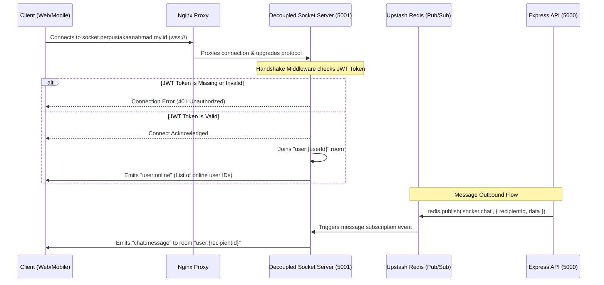

# Socket View Documentation (socket-view.md)

This document provides a comprehensive specification of the WebSocket microservice architecture, connection lifecycle, and event protocol utilized in the **Perpustakaan Digital** system.

---

## 1. Socket Architecture



### 1.1 Connection Flow
* The client connects via a secure WebSocket connection (WSS) to the domain `socket.perpustakaanahmad.my.id`.
* The connection upgrade is proxied by Nginx/Litespeed to the backend Node.js microservice running on port `5001`.

### 1.2 Authentication Flow
* During the connection handshake, the client must pass the JWT access token in the `auth` payload:
  ```javascript
  const socket = io('https://socket.perpustakaanahmad.my.id', {
    auth: { token: 'JWT_ACCESS_TOKEN' }
  });
  ```
* The server verifies the token against the `JWT_ACCESS_SECRET`. If valid, the connection is accepted, and the socket joins a targeted private room named `user:${userId}`.

### 1.3 Reconnection Flow
* If the socket disconnects due to network changes, the client library (`socket.io-client`) attempts to reconnect automatically.
* In the event of reconnect attempts, the client automatically updates its authentication payload with a fresh JWT token to avoid auth expiration errors:
  ```javascript
  socket.io.on('reconnect_attempt', () => {
    socket.auth = { token: getFreshToken() };
  });
  ```

---

## 2. Event Specification

### 2.1 Inbound Events (Client to Server)

#### Event: `chat:join`
* **Trigger Source**: User opens a conversation page on Next.js or React Native.
* **Payload**:
  ```json
  {
    "conversation_id": 42
  }
  ```
* **Consumer**: Socket Server.
* **Impact**: Joins the socket to the room `conversation:${conversation_id}`.
* **Database Impact**: None.
* **Redis Impact**: None.
* **UI Impact**: Prepares the client to receive real-time messages in this room.

#### Event: `chat:leave`
* **Trigger Source**: User navigates away from a conversation room.
* **Payload**:
  ```json
  {
    "conversation_id": 42
  }
  ```
* **Consumer**: Socket Server.
* **Impact**: Removes the socket from room `conversation:${conversation_id}`.
* **Database Impact**: None.
* **Redis Impact**: None.
* **UI Impact**: Disables real-time messages for that specific room.

#### Event: `chat:typing`
* **Trigger Source**: User types into the message input field.
* **Payload**:
  ```json
  {
    "conversation_id": 42,
    "typing": true
  }
  ```
* **Consumer**: Socket Server.
* **Impact**: Broadcasts typing indicator to all members in room `conversation:${conversation_id}` except sender.
* **Database Impact**: None.
* **Redis Impact**: None.
* **UI Impact**: Displays "typing..." indicator next to user name on the recipient's screen.

#### Event: `chat:read`
* **Trigger Source**: User reads a message/opens conversation window.
* **Payload**:
  ```json
  {
    "conversation_id": 42
  }
  ```
* **Consumer**: Socket Server.
* **Impact**: Broadcasts read receipt status to room `conversation:${conversation_id}`.
* **Database Impact**: Marks messages as read in MySQL database.
* **Redis Impact**: None.
* **UI Impact**: Changes tick marks/status to "Read" on sender's screen.

---

### 2.2 Outbound Events (Server to Client)

#### Event: `user:online`
* **Trigger Source**: A socket connects or disconnects.
* **Payload**:
  ```json
  {
    "online_users": [1, 5, 23, 42]
  }
  ```
* **Consumer**: All online clients.
* **Database Impact**: None.
* **Redis Impact**: None.
* **UI Impact**: Updates active online user grids/avatars on dashboards and chat lists.

#### Event: `chat:message`
* **Trigger Source**: Express API publishes a message to Redis channel `socket:chat`.
* **Payload**:
  ```json
  {
    "message_id": 105,
    "conversation_id": 42,
    "sender_id": 1,
    "message_text": "Hello, world!",
    "created_at": "2026-06-02T10:00:00.000Z"
  }
  ```
* **Consumer**: Recipient client.
* **Database Impact**: None (message was already written to MySQL by Express API before publish).
* **Redis Impact**: Consumed from Redis channel `socket:chat`.
* **UI Impact**: Appends the new message dynamically to the message container without requiring a page refresh.

#### Event: `notification:new`
* **Trigger Source**: Express API publishes a notification to Redis channel `socket:notification`.
* **Payload**:
  ```json
  {
    "notification_id": 87,
    "notification_title": "Buku Terlambat",
    "notification_message": "Buku Matematika Anda telah melewati tenggat!",
    "notification_type": "late_warning",
    "created_at": "2026-06-02T10:00:00.000Z"
  }
  ```
* **Consumer**: Targeted client user.
* **Database Impact**: None.
* **Redis Impact**: Consumed from Redis channel `socket:notification`.
* **UI Impact**: Displays a push banner notification on mobile and increments the notification badge counter.
